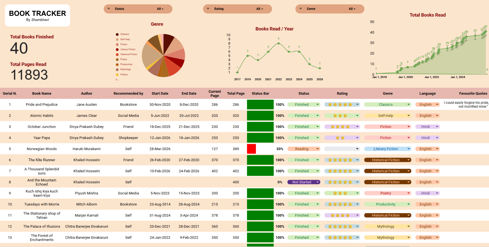
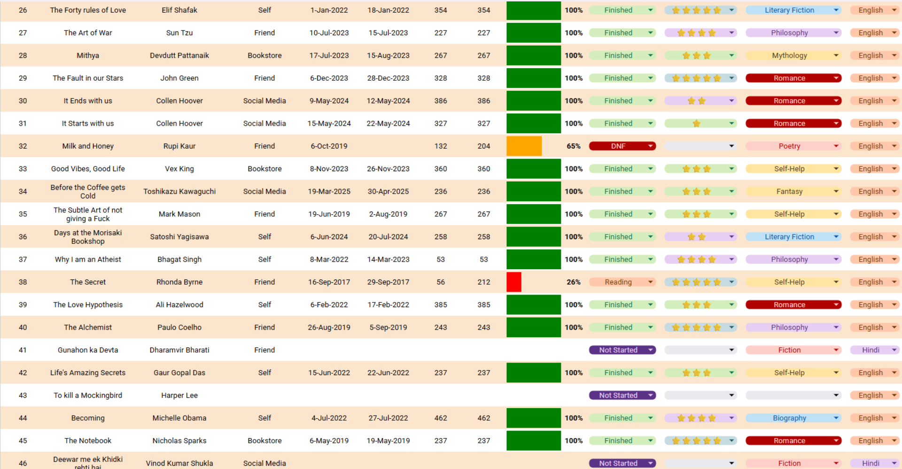

# 📚 Personal Book Tracker Dashboard

A beautifully designed **Google Sheets dashboard** to log, rate, and visualize my personal reading journey. Built to track every book I've read, currently reading, or plan to read — all in one place.

---

## ✨ Features

- 📊 **Interactive Dashboard** with key reading stats at a glance
- 🔍 **Dynamic Filters** by Status, Rating, and Genre
- 📈 **Visual Analytics**:
  - Genre distribution (pie chart)
  - Books read per year (line chart)
  - Cumulative reading growth over time
- ⭐ **Star-based Rating System** for each book
- 🚦 **Progress Tracking** with color-coded status bars (Reading / Finished / DNF / Not Started)
- 🏷️ **Categorization** by Genre, Language, and Recommendation source
- 💬 **Favourite Quotes** section to save memorable lines
- 📅 **Date Tracking** for start and end dates
- 🎨 **Aesthetic UI** with a warm, cohesive color palette

---

## 📖 Book List View

---

## 🛠️ Built With

- **Google Sheets** — core platform
- **Formulas** — `COUNTIF`, `SUMIF`, `SPARKLINE`, `IF`
- **Conditional Formatting** — for status bars and color coding
- **Charts** — pie chart, line charts for analytics
- **Data Validation** — dropdowns for clean data entry

---

## 🚀 How to Use

Want to track your own reading journey? Make a copy of this template:

👉 **[Click here to copy the template] https://docs.google.com/spreadsheets/d/1qPM37i3rO0ImJXWL4cWUaFco6iVIdnknQPSXKPtuobc/copy**

*(Replace the link above with your actual Google Sheets copy link — instructions below!)*

---

## 📌 Future Improvements

- Add average rating & favorite author stats
- Auto-calculate "Days to Finish" each book
- Add reading streaks tracker
- Monthly reading goal tracker
- Mobile-friendly version

---

## 👩‍💻 About Me

Hi! I'm **Shambhavi** — passionate about books, data, and creating things that combine both. This tracker is a personal project that grew from my love for reading and learning data visualization.

- 🌐 GitHub: [@buildwithshambhavi](https://github.com/buildwithshambhavi)
- LinkedIn: https://www.linkedin.com/in/shambhavi-singh-da/

---

⭐ If you like this project, give it a star on GitHub!